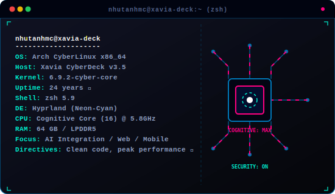
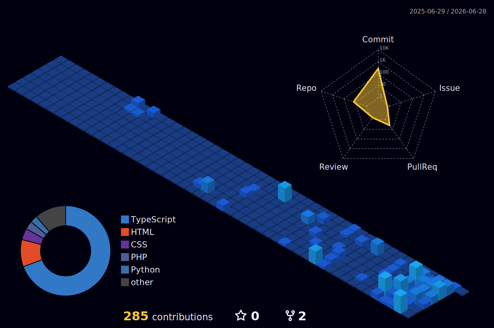
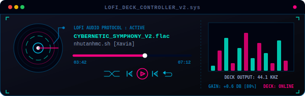

<div align="center">
  <!-- Custom Coded Cockpit Dashboard SVG (v2 - Cyan & Magenta Theme) -->
  
  
  <br/><br/>
  
  <!-- Typing SVG (Blue Theme - Fixed single line carousel) -->
  <a href="https://git.io/typing-svg">
    
  </a>

  <!-- Sleek Cyber Badges -->
  <p>
    
    
    
  </p>
</div>

---

<div align="center">
  <h2>⚡ INTERACTIVE CYBER DECK INTERFACE ⚡</h2>
  <p><i>Click on the command line prompts below to run systems operations on the mainframe.</i></p>
</div>

<br/>

<!-- Command 1: neofetch -->
<details open>
  <summary><b>💻 <code>xavia@cyberdeck ~ % neofetch --theme neon-cyan</code></b></summary>
  <br/>
  <table width="100%" border="0">
    <tr>
      <td width="55%" valign="top">
        <h3>📡 System Shell Instance</h3>
        <p>I'm Anh (Xavia), a full-stack engineer and AI explorer. I build next-generation applications with clean, high-performance architecture and modern UI/UX design.</p>
        
```typescript
// Cybernetic Instance Configuration
const developer = {
  alias: "Xavia",
  fullName: "Anh Nguyen",
  origin: "Vietnam 🌏",
  focus: [
    "Artificial Intelligence Integration 🤖",
    "Cross-Platform Mobile Apps 📱",
    "Modern Web Architecture ⚡"
  ],
  directive: "Clean code, peak performance, delightful UX ✨"
};
```
        <h4>🎯 Core Directives</h4>
        <ul>
          <li>🚀 <strong>Production Ready:</strong> Turning complex algorithms into production-ready software solutions.</li>
          <li>💡 <strong>Constant Learning:</strong> Experimenting with latest advancements in AI and web development.</li>
          <li>🌟 <strong>Architecture:</strong> Structuring software for extreme scalability and maintainability.</li>
        </ul>
      </td>
      <td width="45%" valign="top" align="center">
        <br/><br/>
        <!-- Interactive Developer Terminal (v2 - Spec Panel) -->
        
      </td>
    </tr>
  </table>
</details>

<!-- Command 2: ls -R /mainframe/workspace -->
<details open>
  <summary><b>📁 <code>xavia@cyberdeck ~ % ls -R /mainframe/workspace</code></b></summary>
  <br/>
  <details open>
    <summary><b>📁 nhutanhmc-deck/</b></summary>
    <blockquote>
      
      <details open>
        <summary><b>📁 system_configs/</b></summary>
        <blockquote>
          <details>
            <summary><b>📄 developer_instance.sh</b></summary>
            <br/>
            
```bash
#!/bin/bash
# Neural Interface Configuration
export ALIAS="Xavia"
export REAL_NAME="Anh Nguyen"
export LOCALE="Vietnam 🌏"
export INTEL_CORE="Full-Stack & AI Engineer"
export DIRECTIVE="Clean code, peak performance, delightful UX"
export FOCUS_AREAS="[Artificial Intelligence, Cross-Platform Mobile, Web Architectures]"
echo "System shell successfully initialized for $ALIAS."
```
          </details>
          <details>
            <summary><b>📄 hardware_spec.json</b></summary>
            <br/>
            
```json
{
  "processor": "Cognitive Core (16 Cores) @ 5.8GHz",
  "memory": "64 GB LPDDR5 Dual-Channel",
  "storage": "2 TB NVMe Solid State Subsystem",
  "display": "Holographic Hex-HUD Interface",
  "power": "Fusion Core Reactor (5.8GW Peak Load)"
}
```
          </details>
        </blockquote>
      </details>

      <details open>
        <summary><b>📁 security_mainframe/</b></summary>
        <blockquote>
          <h4>🔓 SYSTEM BREACH PROTOCOL</h4>
          <p><i>A security lock is protecting the administrator dossier. Input the correct hexadecimal sequence to bypass the firewall.</i></p>
          <p><b>REQUIRED BUFFER SEQUENCE:</b> <kbd>7A</kbd> ➔ <kbd>E9</kbd> ➔ <kbd>55</kbd> ➔ <kbd>BD</kbd></p>

          <table align="center" border="1" cellpadding="5" style="border-collapse: collapse; border: 1px solid #00f5d4; text-align: center;">
            <tr>
              <td style="color:#00f5d4; font-weight:bold;">7A</td>
              <td>55</td>
              <td>E9</td>
              <td>BD</td>
            </tr>
            <tr>
              <td>1C</td>
              <td style="color:#ff007f; font-weight:bold;">E9</td>
              <td>7A</td>
              <td>55</td>
            </tr>
            <tr>
              <td style="color:#00f5d4; font-weight:bold;">55</td>
              <td>BD</td>
              <td>1C</td>
              <td>E9</td>
            </tr>
            <tr>
              <td style="color:#ff007f; font-weight:bold;">BD</td>
              <td>7A</td>
              <td>55</td>
              <td>1C</td>
            </tr>
          </table>

          <br/>

          <!-- Root level choices representing initial selections -->
          <details>
            <summary>🔑 Initialize Decryption [Select Node: 7A]</summary>
            <blockquote>
              <p>⚙️ <i>Buffer matched: [7A]... Loading next row vectors...</i></p>
              <p>Choose next sequence node:</p>
              
              <details>
                <summary>🔴 Node: 1C</summary>
                <blockquote>
                  <p>❌ <b>BUFFER OVERFLOW:</b> Sequence mismatch. Firewall triggered. Access Denied.</p>
                </blockquote>
              </details>
              
              <details>
                <summary>🔴 Node: BD</summary>
                <blockquote>
                  <p>❌ <b>BUFFER OVERFLOW:</b> Sequence mismatch. Firewall triggered. Access Denied.</p>
                </blockquote>
              </details>
              
              <details>
                <summary>🟢 Node: E9</summary>
                <blockquote>
                  <p>⚙️ <i>Buffer matched: [7A ➔ E9]... Scanning column traces...</i></p>
                  <p>Choose next sequence node:</p>
                  
                  <details>
                    <summary>🔴 Node: 1C</summary>
                    <blockquote>
                      <p>❌ <b>BUFFER OVERFLOW:</b> Sequence mismatch. Firewall triggered. Access Denied.</p>
                    </blockquote>
                  </details>
                  
                  <details>
                    <summary>🔴 Node: 7A</summary>
                    <blockquote>
                      <p>❌ <b>BUFFER OVERFLOW:</b> Sequence mismatch. Firewall triggered. Access Denied.</p>
                    </blockquote>
                  </details>
                  
                  <details>
                    <summary>🟢 Node: 55</summary>
                    <blockquote>
                      <p>⚙️ <i>Buffer matched: [7A ➔ E9 ➔ 55]... Scanning final row traces...</i></p>
                      <p>Choose final sequence node:</p>
                      
                      <details>
                        <summary>🔴 Node: 55</summary>
                        <blockquote>
                          <p>❌ <b>BUFFER OVERFLOW:</b> Sequence mismatch. Firewall triggered. Access Denied.</p>
                        </blockquote>
                      </details>
                      
                      <details>
                        <summary>🔴 Node: E9</summary>
                        <blockquote>
                          <p>❌ <b>BUFFER OVERFLOW:</b> Sequence mismatch. Firewall triggered. Access Denied.</p>
                        </blockquote>
                      </details>
                      
                      <details>
                        <summary>🟢 Node: BD</summary>
                        <blockquote>
                          <p>🎉 <b>FIREWALL BYPASSED. DOSSIER DECRYPTED.</b></p>
                          
```json
{
  "subject_alias": "Xavia",
  "fullName": "Anh Nguyen",
  "dossier_type": "Personal Administrator Credentials",
  "clearance": "Level 5 System Engineer",
  "fun_facts": {
    "coffee_ratio": "1:3 (Code:Coffee) ☕",
    "optimal_runtime": "22:00 - 02:00 VN Time 🌙",
    "automation_directive": "If it can be automated, script it ⚙️"
  }
}
```
                        </blockquote>
                      </details>
                    </blockquote>
                  </details>
                </blockquote>
              </details>
            </blockquote>
          </details>

          <details>
            <summary>🔑 Initialize Decryption [Select Node: E9]</summary>
            <blockquote>
              <p>❌ <b>BUFFER OVERFLOW:</b> Sequence mismatch. Firewall triggered. Access Denied.</p>
            </blockquote>
          </details>

          <details>
            <summary>🔑 Initialize Decryption [Select Node: 55]</summary>
            <blockquote>
              <p>❌ <b>BUFFER OVERFLOW:</b> Sequence mismatch. Firewall triggered. Access Denied.</p>
            </blockquote>
          </details>

          <details>
            <summary>🔑 Initialize Decryption [Select Node: BD]</summary>
            <blockquote>
              <p>❌ <b>BUFFER OVERFLOW:</b> Sequence mismatch. Firewall triggered. Access Denied.</p>
            </blockquote>
          </details>
        </blockquote>
      </details>

      <details open>
        <summary><b>📁 projects_depot/</b></summary>
        <blockquote>
          <p>Displaying key repositories and codebases active on this deck:</p>
          <table width="100%">
            <tr>
              <td><b>Project Depot</b></td>
              <td><b>Security Status</b></td>
              <td><b>Mainframe Workload</b></td>
              <td><b>Briefing Details</b></td>
            </tr>
            <tr>
              <td><code>nhutanhmc-deck</code></td>
              <td>🟢 SECURED</td>
              <td>98% CPU Load</td>
              <td>Holographic Cyberpunk Console profile interface.</td>
            </tr>
            <tr>
              <td><code>ai-integration-node</code></td>
              <td>🟡 STANDBY</td>
              <td>12% CPU Load</td>
              <td>Deep learning orchestration server wrapper.</td>
            </tr>
            <tr>
              <td><code>flutter-synergy-core</code></td>
              <td>🟢 RUNNING</td>
              <td>45% CPU Load</td>
              <td>Cross-platform engine optimization tools.</td>
            </tr>
          </table>
        </blockquote>
      </details>
      
    </blockquote>
  </details>
</details>

<!-- Command 3: nmap --scan-ports /mainframe/tech-orbit -->
<details open>
  <summary><b>🌌 <code>xavia@cyberdeck ~ % nmap --scan-ports /mainframe/tech-orbit</code></b></summary>
  <br/>
  <div align="center">
    <!-- Interactive animated 3D Tech Constellation SVG (v2 - Constellation Blueprint) -->
    
  </div>

  <br/>

  <div align="center">
  <h3>🛠️ Tech Stack & Expertise</h3>

  #### 💻 Languages & Core Technologies
  <table>
    <tr>
      <td align="center" width="96">
        <br>JavaScript
      </td>
      <td align="center" width="96">
        <br>TypeScript
      </td>
      <td align="center" width="96">
        <br>Java
      </td>
      <td align="center" width="96">
        <br>Dart
      </td>
      <td align="center" width="96">
        <br>HTML5
      </td>
      <td align="center" width="96">
        <br>CSS3
      </td>
    </tr>
  </table>

  #### 🚀 Frontend Frameworks & Libraries
  <table>
    <tr>
      <td align="center" width="96">
        <br>React
      </td>
      <td align="center" width="96">
        <br>Next.js
      </td>
      <td align="center" width="96">
        <br>Vue.js
      </td>
      <td align="center" width="96">
        <br>Flutter
      </td>
      <td align="center" width="96">
        <br>Tailwind
      </td>
      <td align="center" width="96">
        <br>Sass
      </td>
    </tr>
  </table>

  #### ⚙️ Backend & Server Technologies
  <table>
    <tr>
      <td align="center" width="96">
        <br>Node.js
      </td>
      <td align="center" width="96">
        <br>Express
      </td>
      <td align="center" width="96">
        <br>Spring Boot
      </td>
      <td align="center" width="96">
        <br>GraphQL
      </td>
      <td align="center" width="96">
        <br>Prisma
      </td>
      <td align="center" width="96">
        <br>NestJS
      </td>
    </tr>
  </table>

  #### 🗄️ Databases & Storage
  <table>
    <tr>
      <td align="center" width="96">
        <br>MongoDB
      </td>
      <td align="center" width="96">
        <br>PostgreSQL
      </td>
      <td align="center" width="96">
        <br>MySQL
      </td>
      <td align="center" width="96">
        <br>Redis
      </td>
      <td align="center" width="96">
        <br>Firebase
      </td>
      <td align="center" width="96">
        <br>Supabase
      </td>
    </tr>
  </table>

  #### ☁️ DevOps & Cloud Services
  <table>
    <tr>
      <td align="center" width="96">
        <br>Docker
      </td>
      <td align="center" width="96">
        <br>Git
      </td>
      <td align="center" width="96">
        <br>GitHub
      </td>
      <td align="center" width="96">
        <br>Vercel
      </td>
      <td align="center" width="96">
        <br>AWS
      </td>
      <td align="center" width="96">
        <br>VS Code
      </td>
    </tr>
  </table>
  </div>
</details>

<!-- Command 4: cat /sys/performance/metrics -->
<details open>
  <summary><b>📊 <code>xavia@cyberdeck ~ % cat /sys/performance/metrics</code></b></summary>
  <br/>
  
  <h3 align="center">🔮 3D CONTRIBUTION LANDSCAPE</h3>
  <div align="center">
    
  </div>

  <br/>

  <h3 align="center">🐍 BLUE SNAKE CONTRIBUTION GRID</h3>
  <div align="center">
    <picture>
      <source media="(prefers-color-scheme: dark)" srcset="dist/github-contribution-grid-snake-dark.svg" />
      <source media="(prefers-color-scheme: light)" srcset="dist/github-contribution-grid-snake.svg" />
      
    </picture>
  </div>

  <br/>

  <h3 align="center">📊 PERFORMANCE METRICS</h3>
  <div align="center">
    <table border="0" width="100%">
      <tr>
        <td align="center" width="50%">
          
        </td>
        <td align="center" width="50%">
          
        </td>
      </tr>
      <tr>
        <td align="center" width="50%">
          
        </td>
        <td align="center" width="50%">
          
        </td>
      </tr>
    </table>
    <br/>
    
  </div>

  <br/>

  <h3 align="center">⏰ WEEKLY RUNTIME BREAKDOWN</h3>
  <div align="center">
    <!--START_SECTION:waka-->
    <!--END_SECTION:waka-->
  </div>
</details>

<!-- Command 5: audio-player --stream /sys/audio/lofi_ambient -->
<details open>
  <summary><b>🎵 <code>xavia@cyberdeck ~ % audio-player --stream /sys/audio/lofi_ambient</code></b></summary>
  <br/>
  <div align="center">
    <!-- Interactive animated Cyberpunk Audio Deck SVG (v2 - Equalizer Console) -->
    
  </div>

  <br/>

  <table width="100%">
    <tr>
      <td width="50%" valign="top">
        <h3>🎯 CURRENT DIRECTIVES</h3>
        <ul>
          <li>🌐 <strong>Web Architectures:</strong> Scaling robust SSR applications via Next.js and Vue 3.</li>
          <li>📱 <strong>Mobile Modules:</strong> Deploying smooth Flutter performance and native bridging.</li>
          <li>⚡ <strong>Speed Tuning:</strong> Advancing core web vitals and reducing server latency.</li>
          <li>🔄 <strong>Realtime Engine:</strong> Integrating bi-directional sockets and WebRTC channels.</li>
        </ul>
      </td>
      <td width="50%" valign="top">
        <h3>🌱 LEARNING JOURNEY</h3>
        <ul>
          <li>🏗️ <strong>System Architecture:</strong> Designing resilient microservice blueprints and federation nodes.</li>
          <li>🔄 <strong>Infrastructure:</strong> Automating workflows with CI/CD and container clustering.</li>
          <li>🤖 <strong>Deep Learning:</strong> Integrating predictive models and NLP tooling directly into client portals.</li>
          <li>💙 <strong>Type Integrity:</strong> Building highly structured models utilizing advanced TypeScript patterns.</li>
        </ul>
      </td>
    </tr>
  </table>

  <br/>

  <h3 align="center">💡 SERVICE MATRIX (WHAT I DO)</h3>
  <div align="center">
    <table width="100%">
      <tr>
        <td align="center" width="25%">
          
          <h4>Frontend</h4>
          <p>Interactive web interfaces, responsive modules, and responsive layout styling</p>
        </td>
        <td align="center" width="25%">
          
          <h4>Backend</h4>
          <p>Highly scalable API interfaces, backend servers, and database integration</p>
        </td>
        <td align="center" width="25%">
          
          <h4>Mobile</h4>
          <p>Cross-platform application packaging using Flutter with native speed</p>
        </td>
        <td align="center" width="25%">
          
          <h4>Optimization</h4>
          <p>SEO index tuning, load balancing, speed profiling, and high code quality</p>
        </td>
      </tr>
    </table>
  </div>

  <br/>

  <h3 align="center">⚡ DIAGNOSTIC DATA (FUN FACTS)</h3>
  <div align="center">
    <table border="0">
      <tr><td>☕</td><td><b>Fuel Level:</b> Code-to-coffee ratio is approximately 1:3</td></tr>
      <tr><td>🌙</td><td><b>Optimal Runtime:</b> Peak processing occurs between 10 PM and 2 AM</td></tr>
      <tr><td>🎮</td><td><b>Sandbox Simulation:</b> Debugging is treated as a logic-based sandbox puzzle</td></tr>
      <tr><td>📚</td><td><b>Core Update:</b> Lifelong library updates in progress</td></tr>
      <tr><td>🚀</td><td><b>Automation Protocol:</b> If it can be automated, it will be scripted</td></tr>
    </table>
  </div>
</details>

<!-- Command 6: mailto -t nhutanhmc@gmail.com -->
<details open>
  <summary><b>📫 <code>xavia@cyberdeck ~ % mailto -t nhutanhmc@gmail.com</code></b></summary>
  <br/>
  <h3 align="center">📡 ESTABLISH COMMUNICATIONS</h3>
  <p align="center">
    <a href="https://github.com/nhutanhmc" target="_blank"></a>
    <a href="https://www.linkedin.com/in/anh-nguyen-296b53333/" target="_blank"></a>
    <a href="https://www.facebook.com/Xavia0205?locale=vi_VN" target="_blank"></a>
    <a href="mailto:nhutanhmc@gmail.com"></a>
  </p>

  <br/>

  <div align="center">
    <table border="0">
      <tr>
        <td align="center" width="25%"><br>Collaborations</td>
        <td align="center" width="25%"><br>Freelance Work</td>
        <td align="center" width="25%"><br>Tech Discussions</td>
        <td align="center" width="25%"><br>Mentoring</td>
      </tr>
    </table>
  </div>
</details>

---

<div align="center">
  
  <p align="center">
    
    <b>Made with ❤️, lots of ☕, and countless commits</b>
    
  </p>
  <p align="center">
    <i>⭐ If you like my work, don't forget to star my repositories! ⭐</i>
  </p>
</div>
