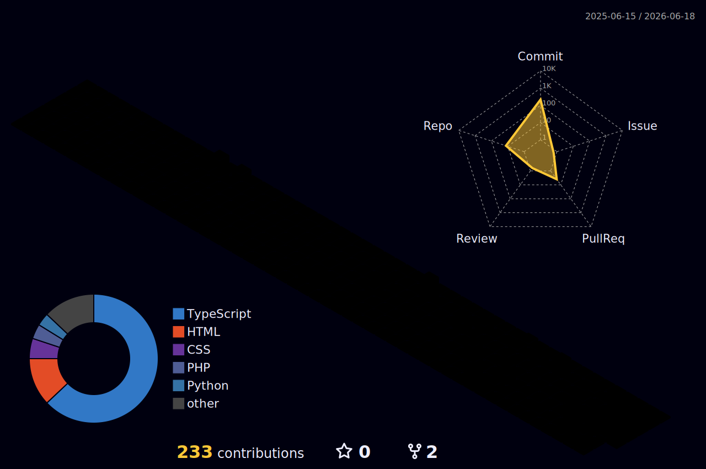

<div align="center">
  <!-- Custom 3D Cyberpunk Workspace Header Image -->
  
  
  <br/><br/>
  
  <!-- Typing SVG with URL encoding fixed -->
  <a href="https://git.io/typing-svg">
    
  </a>

  <!-- Sleek Cyber Badges -->
  <p>
    
    
    
  </p>
</div>

---

<h2 align="center">📡 SYSTEM SHELL : nhutanhmc.sh</h2>

<table width="100%" border="0">
  <tr>
    <td width="55%" valign="top">
      <h3>💻 About The Developer</h3>
      <p>I'm Anh (Xavia), a full-stack engineer and AI explorer. I build next-generation applications with clean, high-performance architecture and modern UI/UX design.</p>
      
```typescript
// Cybernetic Instance Configuration
const developer = {
  alias: "Xavia",
  fullName: "Anh Nguyen",
  origin: "Vietnam 🌏",
  focus: [
    "Artificial Intelligence Integration 🤖",
    "Cross-Platform Mobile Apps 📱",
    "Modern Web Architecture ⚡"
  ],
  directive: "Clean code, peak performance, delightful UX ✨"
};
```

      <h4>🎯 Core Directives</h4>
      <ul>
        <li>🚀 <strong>Production Ready:</strong> Turning complex algorithms into production-ready software solutions.</li>
        <li>💡 <strong>Constant Learning:</strong> Experimenting with latest advancements in AI and web development.</li>
        <li>🌟 <strong>Architecture:</strong> Structuring software for extreme scalability and maintainability.</li>
      </ul>
    </td>
    <td width="45%" valign="top" align="center">
      <br/><br/>
      <!-- Interactive Developer GIF -->
      
    </td>
  </tr>
</table>

---

<h2 align="center">🔮 3D CONTRIBUTION LANDSCAPE</h2>
<div align="center">
  <!-- Night Rainbow 3D graph (using correct name that exists) -->
  
</div>

<br/>

<h2 align="center">🐍 SNAKE CONTRIBUTION GRID</h2>
<div align="center">
  <picture>
    <source media="(prefers-color-scheme: dark)" srcset="dist/github-contribution-grid-snake-dark.svg" />
    <source media="(prefers-color-scheme: light)" srcset="dist/github-contribution-grid-snake.svg" />
    
  </picture>
</div>

---

<h2 align="center">🛠️ TECH MATRIX</h2>
<div align="center">
  <table border="0">
    <tr>
      <td align="center" width="160"><b>FRONTEND & UI</b></td>
      <td>
        
      </td>
    </tr>
    <tr>
      <td align="center" width="160"><b>BACKEND & DATA</b></td>
      <td>
        
      </td>
    </tr>
    <tr>
      <td align="center" width="160"><b>MOBILE & DEVOPS</b></td>
      <td>
        
      </td>
    </tr>
  </table>
</div>

---

<h2 align="center">📊 PERFORMANCE METRICS</h2>
<div align="center">
  <table border="0" width="100%">
    <tr>
      <td align="center" width="50%">
        
      </td>
      <td align="center" width="50%">
        
      </td>
    </tr>
    <tr>
      <td align="center" width="50%">
        
      </td>
      <td align="center" width="50%">
        
      </td>
    </tr>
  </table>
  <br/>
  
</div>

---

<h2 align="center">⏰ WEEKLY RUNTIME BREAKDOWN</h2>
<div align="center">

<!--START_SECTION:waka-->
<!--END_SECTION:waka-->

</div>

---

<table width="100%">
  <tr>
    <td width="50%" valign="top">
      <h3>🎯 CURRENT DIRECTIVES</h3>
      <ul>
        <li>🌐 <strong>Web Architectures:</strong> Scaling robust SSR applications via Next.js and Vue 3.</li>
        <li>📱 <strong>Mobile Modules:</strong> Deploying smooth Flutter performance and native bridging.</li>
        <li>⚡ <strong>Speed Tuning:</strong> Advancing core web vitals and reducing server latency.</li>
        <li>🔄 <strong>Realtime Engine:</strong> Integrating bi-directional sockets and WebRTC channels.</li>
      </ul>
    </td>
    <td width="50%" valign="top">
      <h3>🌱 LEARNING JOURNEY</h3>
      <ul>
        <li>🏗️ <strong>System Architecture:</strong> Designing resilient microservice blueprints and federation nodes.</li>
        <li>🔄 <strong>Infrastructure:</strong> Automating workflows with CI/CD and container clustering.</li>
        <li>🤖 <strong>Deep Learning:</strong> Integrating predictive models and NLP tooling directly into client portals.</li>
        <li>💙 <strong>Type Integrity:</strong> Building highly structured models utilizing advanced TypeScript patterns.</li>
      </ul>
    </td>
  </tr>
</table>

---

<h2 align="center">💡 SERVICE MATRIX (WHAT I DO)</h2>
<div align="center">
  <table width="100%">
    <tr>
      <td align="center" width="25%">
        
        <h4>Frontend</h4>
        <p>Interactive web interfaces, responsive modules, and responsive layout styling</p>
      </td>
      <td align="center" width="25%">
        
        <h4>Backend</h4>
        <p>Highly scalable API interfaces, backend servers, and database integration</p>
      </td>
      <td align="center" width="25%">
        
        <h4>Mobile</h4>
        <p>Cross-platform application packaging using Flutter with native speed</p>
      </td>
      <td align="center" width="25%">
        
        <h4>Optimization</h4>
        <p>SEO index tuning, load balancing, speed profiling, and high code quality</p>
      </td>
    </tr>
  </table>
</div>

---

<h2 align="center">📫 ESTABLISH COMMUNICATIONS</h2>
<p align="center">
  <a href="https://github.com/nhutanhmc" target="_blank"></a>
  <a href="https://www.linkedin.com/in/anh-nguyen-296b53333/" target="_blank"></a>
  <a href="https://www.facebook.com/Xavia0205?locale=vi_VN" target="_blank"></a>
  <a href="mailto:nhutanhmc@gmail.com"></a>
</p>

<div align="center">
  <table border="0">
    <tr>
      <td align="center" width="25%"><br>Collaborations</td>
      <td align="center" width="25%"><br>Freelance Work</td>
      <td align="center" width="25%"><br>Tech Discussions</td>
      <td align="center" width="25%"><br>Mentoring</td>
    </tr>
  </table>
</div>

---

<h3 align="center">⚡ DIAGNOSTIC DATA (FUN FACTS)</h3>
<div align="center">
  <table border="0">
    <tr><td>☕</td><td><b>Fuel Level:</b> Code-to-coffee ratio is approximately 1:3</td></tr>
    <tr><td>🌙</td><td><b>Optimal Runtime:</b> Peak processing occurs between 10 PM and 2 AM</td></tr>
    <tr><td>🎮</td><td><b>Sandbox Simulation:</b> Debugging is treated as a logic-based sandbox puzzle</td></tr>
    <tr><td>📚</td><td><b>Core Update:</b> Lifelong library updates in progress</td></tr>
    <tr><td>🚀</td><td><b>Automation Protocol:</b> If it can be automated, it will be scripted</td></tr>
  </table>
</div>

---

<div align="center">
  
  <p align="center">
    
    <b>Made with ❤️, lots of ☕, and countless commits</b>
    
  </p>
  <p align="center">
    <i>⭐ If you like my work, don't forget to star my repositories! ⭐</i>
  </p>
</div>
